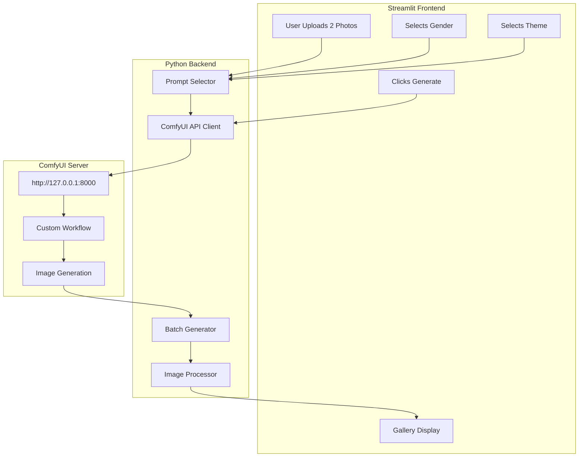
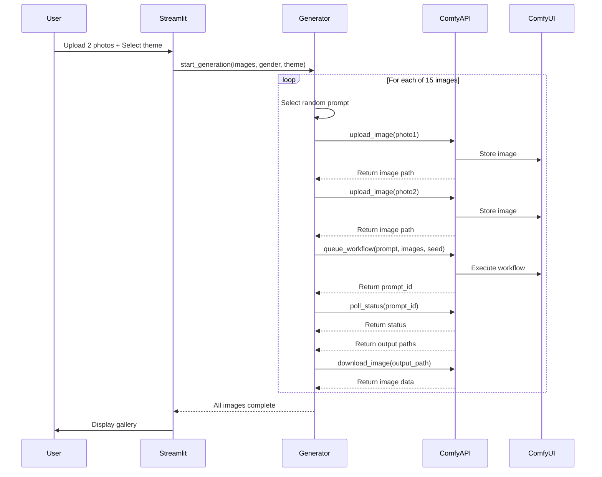

# AI Instagram Dump Generator - Architecture

## System Overview



## Project Structure

```
ai-instagram-dump-generator/
├── app.py                      # Main Streamlit application
├── config.py                   # Configuration settings
├── requirements.txt            # Python dependencies
├── src/
│   ├── __init__.py
│   ├── comfyui_client.py       # ComfyUI API connector
│   ├── prompt_engine.py        # Prompt template manager
│   ├── batch_generator.py      # Batch generation logic
│   └── image_utils.py          # Image processing utilities
├── prompts/
│   ├── male/                   # Male-specific prompts
│   │   ├── cinematic.txt
│   │   ├── vintage.txt
│   │   ├── beach.txt
│   │   ├── streetwear.txt
│   │   └── ...
│   └── female/                 # Female-specific prompts
│       ├── cinematic.txt
│       ├── vintage.txt
│       ├── beach.txt
│       ├── streetwear.txt
│       └── ...
├── workflows/
│   └── workflow_api.json       # Exported ComfyUI workflow
├── generated/                  # Output folder for generated images
└── temp/                       # Temporary upload storage
```

## Key Components

### 1. ComfyUI API Client
- Connects to `http://127.0.0.1:8000`
- Uploads 2 user images to ComfyUI
- Submits workflow with prompts
- Polls for completion
- Downloads generated images

### 2. Prompt Engine
- Gender-based prompt segmentation (male/female)
- Theme-based prompt categories:
  - Cinematic
  - Vintage
  - Beach
  - Streetwear
  - Minimalist
  - Dark Aesthetic
  - Nature
  - Urban
  - Luxury
  - Casual
  - Formal
  - Artistic
- Each theme has 10-20 curated prompts
- Prompts support variable injection for customization

### 3. Batch Generator
- Generates 10-20 images per request
- Uses different prompts from theme pool
- Varies seeds for diversity
- Tracks generation progress
- Handles failures gracefully

### 4. Streamlit Frontend
- Clean UI for photo upload (2 images)
- Gender selection (Male/Female)
- Theme dropdown
- Progress bar during generation
- Gallery grid for results
- Individual download + ZIP download

## Workflow Integration

The ComfyUI workflow should have:
1. Two `Load Image` nodes (for user uploads)
2. A `Prompt` node that accepts text input
3. An IPAdapter or similar for face/body transfer
4. KSampler for generation
5. Save Image node

The API will:
1. Upload user images to ComfyUI
2. Modify the workflow JSON to inject:
   - Uploaded image paths
   - Selected prompt
   - Random seed
3. Queue the workflow
4. Poll until complete
5. Retrieve output images

## Configuration

```python
# config.py
COMFYUI_HOST = "127.0.0.1"
COMFYUI_PORT = 8000
WORKFLOW_FILE = "workflows/workflow_api.json"
OUTPUT_DIR = "generated"
TEMP_DIR = "temp"
IMAGES_PER_BATCH = 15  # 10-20 range
MAX_CONCURRENT = 2     # Parallel generations
```

## Prompt Template Structure

```
# prompts/male/cinematic.txt
A man standing on a rooftop at golden hour, cinematic lighting, film grain, 35mm lens, dramatic shadows, movie poster aesthetic, professional photography, 8k quality, moody atmosphere

A man walking through neon-lit city streets at night, cinematic color grading, anamorphic lens flare, cyberpunk vibes, rain-slicked pavement reflections, editorial style

...
```

## API Flow


